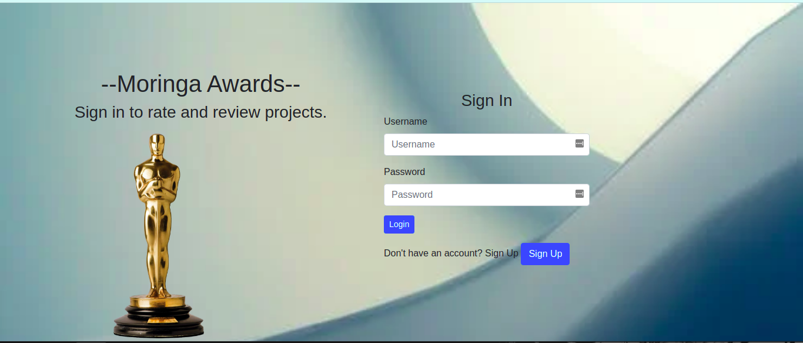
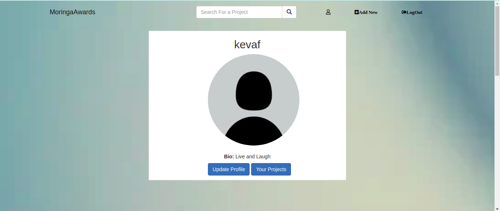
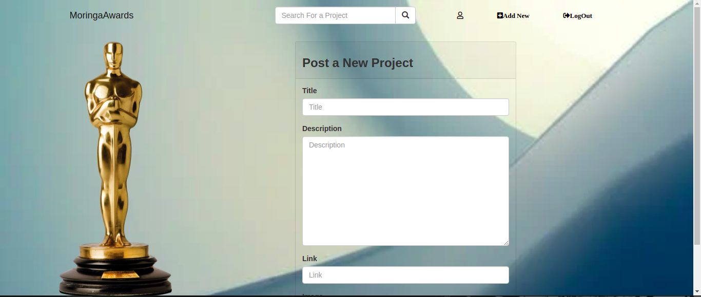

# Moringa Awards

An application for rating and reviewing websites posted by users.

## Description.
This is a web app that allows users to sign up and log in to the website and also post projects to be viewes by other users. Other users can rate and review projects based on its usability, design and content.

## Setup/Installations.
1. A PC mainly with an Operating system.
2. Python3.6 or later is installed in your PC.
3. Postgresql installed
4. clone the directory into your local machine
5. navigate to the cloned folder by cd Instagram_clone
6. Create a virtual environment
7. run source virtual/bin/activate
8. pip install requirements.txt
9. run python3.6 manage.py runserver
10. The application should work
11. for the test run python manage.py test Awards

## Technologies Used
1. Python
2. Flask
3. Heroku - Deployment
4. HTML
5. CSS/Bootstrap

## Author & Contact Information.
This web app was created by Kevin Kipyegon. If you have any suggestions or improvements you can reach the author via mail at kevin.kipyegon@student.moringaschool.com.

## Project Screenshot

## Liscence.
This is an open source project avaiable under the [MIT Liscence](LISCENCE).